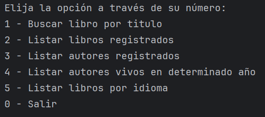

<h1>Literalura</h1>

Aplicación en consola para consulta de los libros y autores a través de la API <a href="https://gutendex.com">Gutendex
</a>

<h4 align="center">Proyecto Finalizado</h3>

<h3>📁 Acceso al proyecto</h3>
<ol>
  <li>Descarga el proyecto desde este repositorio.</li>
  <li>Crea una base de datos en postgresSQL llamada "literalura", las tablas y relaciones se crean al ejecutar el proyecto.</li>
  <li>Crea las variables de entorno utilizadas en application.properties .</li>
  <li>Asegurate de contar con las tecnologías necesarias para ejecutar el proyecto (Consúltalas al final del Readme)</li>
</ol>

<h3>🛠️ Abre y ejecuta el proyecto</h3>

En consola se nos muestra un menú con las consultas disponibles .

<ol>
  <li>Buscar un libro y registrarlo en la base de datos, se aconseja ingresar el nombre del libro en su idioma original o en inglés.</li>  
  <li>Se listan todos los libros guardados en la base de datos.</li>
  <li>Se listan los autores de los libros registrados. </li>
  <li>Se solicita un año, ingresarlo en números (ej: 1900). Se listan los autores registrados que estuvieron vivos durante ese año.</li>
  <li>Se solicita ingresar un idioma, utilizar las iniciales proporcionadas (ej: pt). Se listan todos los libros registrados en ese idioma.</li>
</ol>

Realice otra consulta o ingrese 0 para terminar la ejecución.

<h3>✔️ Tecnologías utilizadas</h3>
<ul>
  <li>Java 22.</li>
  <li>Spring Boot</li>  
  <li>postgreSQL</li>
  <li>Gutendex.</li>
</ul>
